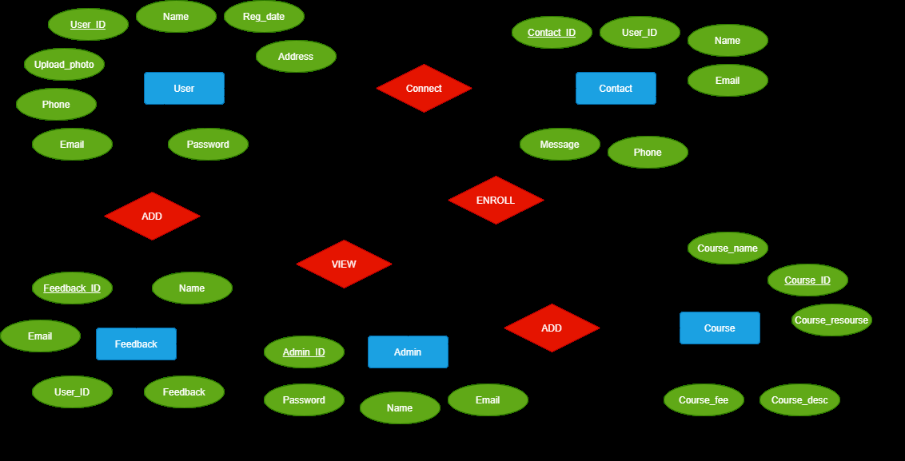
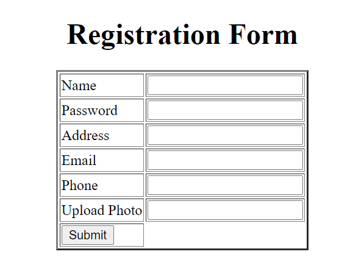
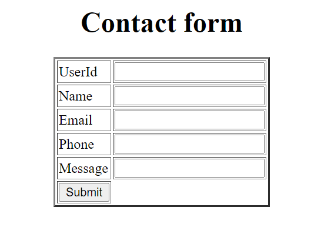
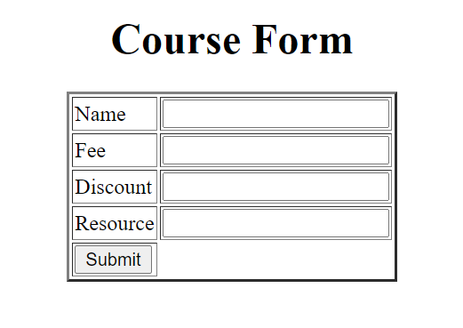
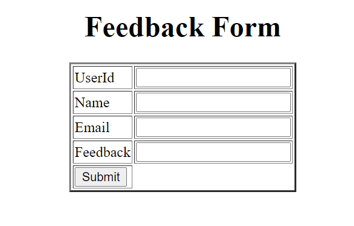

#E-learning Project

This project is part of the final evaluation of the full-stack java course by TechAcademy.

###ER Diagram

### Technologies Used

- Java 8
- Spring Boot 2.6.1
- Maven
- Thymeleaf
- MySQL database

### Observations

The relationship between Users and Courses isn't right/making sense. It might be a Many To Many relationship or a One To Many (one course to many users).   
Also, there isn't a foreign key (userId or courseId) mapped at the respective models on diagram.

### How to start this project

1. Unzip the *elearninspringboot* folder
2. Open an IDE (IntelliJ or Eclipse) and choose the *elearningspringboot* folder
3. Open the *pom.xml* file and download all the dependencies
4. Start the project
5. Test the endpoints at an API Client under the URL <localhost:8080/>

### Front-end part

Since I wasn't able to connect the front-end to my server, I'll put the Thymeleaf forms that I made here.

- **Registration Form**

- **Contact Form**

- **Course Form**

- **Feedback Form**

## Contact info

If you have any question, please reach me out!
milena.vieira@amdocs.com